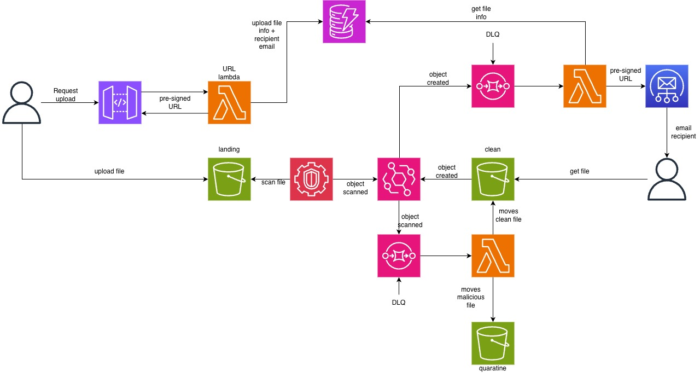

# Event-Driven Secure File Transfer System

An event-driven backend system for securely transferring files between users, inspired by services like WeTransfer.  
The system uses **direct-to-S3 uploads**, **asynchronous malware scanning**, and **event-driven architecture** to safely deliver files without handling file contents on the backend.

This project is intentionally **backend-only**, focusing on cloud architecture, security, and event-driven design rather than frontend concerns. Third parties could build their own front-end and integrate with this system.

---

## 🧠 Motivation

This project explores a **cloud-native, event-driven approach** where:
- Files are uploaded directly to object storage
- Security checks happen asynchronously
- Independent services react to events instead of calling each other directly

The result is a system that is **scalable, secure, and loosely coupled**.

---

## 🏗️ Architecture Overview

At a high level, the system consists of:

- **API service** for issuing upload permissions
- **S3 buckets** for ingestion, clean files, and quarantined files
- **EventBridge** for routing events
- **Lambda functions** for processing steps
- **GuardDuty Malware Protection for S3**
- **SES** for email notifications



---

## 🔁 High-Level Workflow

1. A client requests permission to upload a file
2. The backend issues a **pre-signed S3 PUT URL**
3. The client uploads the file directly to S3
4. S3 emits an object creation event
5. GuardDuty asynchronously scans the file for malware
6. Based on the scan result:
   - Clean files are moved to a secure download bucket
   - Malicious files are quarantined
7. The recipient is notified via email with a pre-signed download link (if clean)

All processing beyond the initial request is **fully event-driven**.

---

## 🔐 Secure File Uploads

- Files are uploaded **directly from the client to S3**
- Upload permissions are:
  - Time-limited
  - Scoped to a single object
  - Granted via pre-signed URLs
- The backend never receives file contents
- All S3 buckets block public access

This approach mirrors production systems used by large-scale file-sharing platforms.

---

## 🧩 Event-Driven Design

The system follows a strict rule:

> **Services never call each other directly — they only react to events.**

This enables:
- Loose coupling between services
- Easy extensibility
- Clear separation of responsibilities

---

## 🛠️ Technology Stack

**Cloud & Infrastructure**
- AWS S3
- AWS Lambda
- AWS EventBridge
- AWS GuardDuty (Malware Protection for S3)
- AWS SES
- AWS DynamoDB

**Backend**
- NodeJS
- AWS SDK

**Infrastructure as Code**
- Terraform

This project is fully serverless.

---

## 🧪 Usage (No Frontend Required)

This project can be tested entirely from the command line.

### Request an upload URL
```bash
POST /uploads
```

Returns:
- Upload ID
- Pre-signed PUT URL
- Expiry time

### Upload a file
```bash
curl -X PUT \
  -H "Content-Type: application/pdf" \
  --upload-file report.pdf \
  "<presigned_url>"
```

All subsequent steps occur asynchronously via events.

---

## 📊 Observability & Debugging

- Each upload is assigned a unique `upload_id`
- All logs include the `upload_id` for easy tracing
- CloudWatch logs show the full lifecycle of each file
- EventBridge can be used to replay events for debugging

---

## 🔍 Design Considerations

This project deliberately focuses on:
- Security-first file handling
- Eventual consistency
- Idempotent processing
- Least-privilege IAM policies
- Failure isolation between services

Trade-offs and limitations are documented in code and comments where relevant.

---

## 🚧 Future Enhancements

Potential extensions include:
- Multi-file uploads
- Download expiry and automatic cleanup
- Audit logs and access tracking
- Authentication (e.g. Cognito)
- Admin alerts for quarantined files
- Frontend client (out of scope for this project)

---

## 📌 Why This Project Exists

This repository is intended as:
- A learning exercise in event-driven cloud architecture
- A portfolio project demonstrating production-style backend design
- A reference for secure, asynchronous file processing patterns
